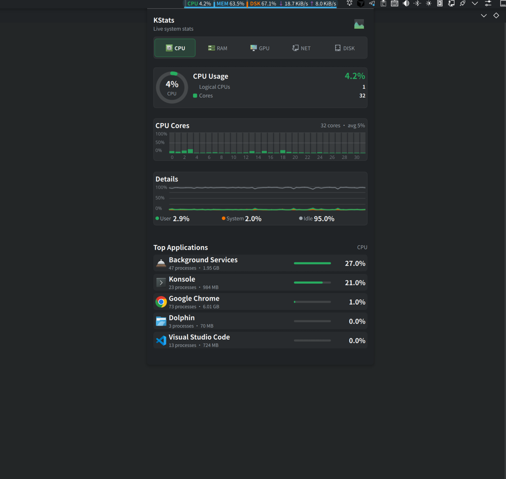
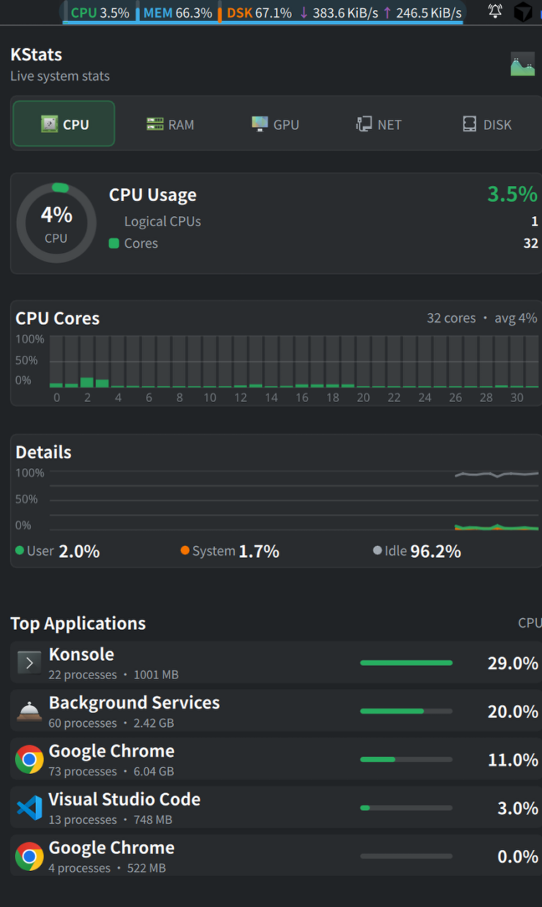
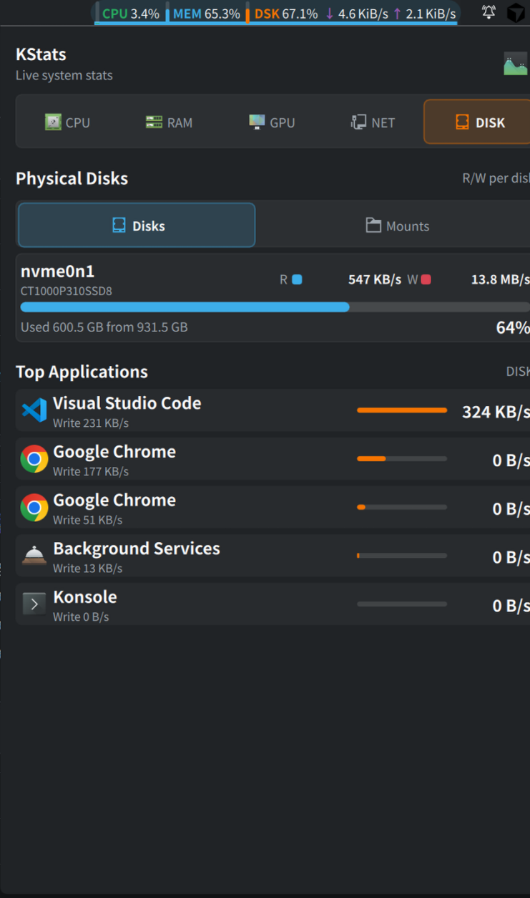

# KStats

KStats is a KDE Plasma 6 panel widget inspired by exelban/stats. The first
version focuses on a menu-bar style status strip with a click-to-open dropdown,
using CPU, memory, disk, and network readings from KDE's KSysGuard sensor API.

## Screenshots

### Overview



### CPU details



### Disk details



## Install for the current user

```sh
kpackagetool6 --type Plasma/Applet --install .
```

After installing, add `KStats` from Plasma's widget picker.

For local testing without installing:

```sh
plasmoidviewer --applet .
```

## Scope

Implemented:

- compact panel representation
- Stats-like expanded dropdown with CPU, GPU, NET, and DISK tabs
- CPU, memory, disk, network sensors
- configurable sensor IDs and update interval
- optional GPU usage, memory, and temperature sensors

Not implemented yet:

- thermal, voltage, power, and fan sensors

Those require hardware-specific Linux backends or deeper integration with KDE's
sensor browser and should be added after the basic widget is stable.
