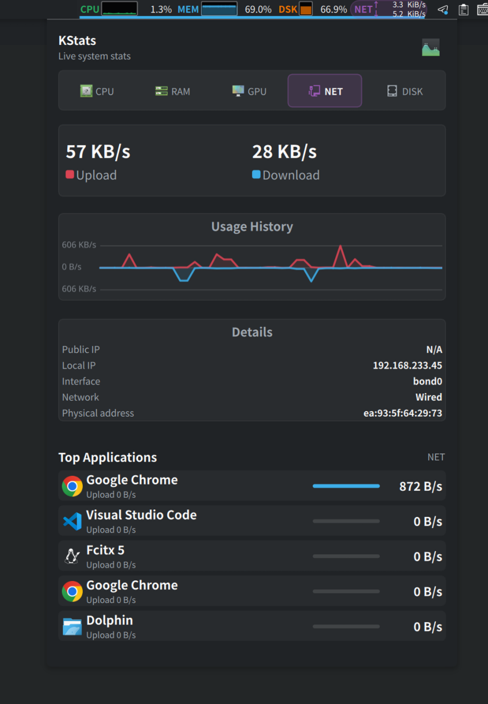
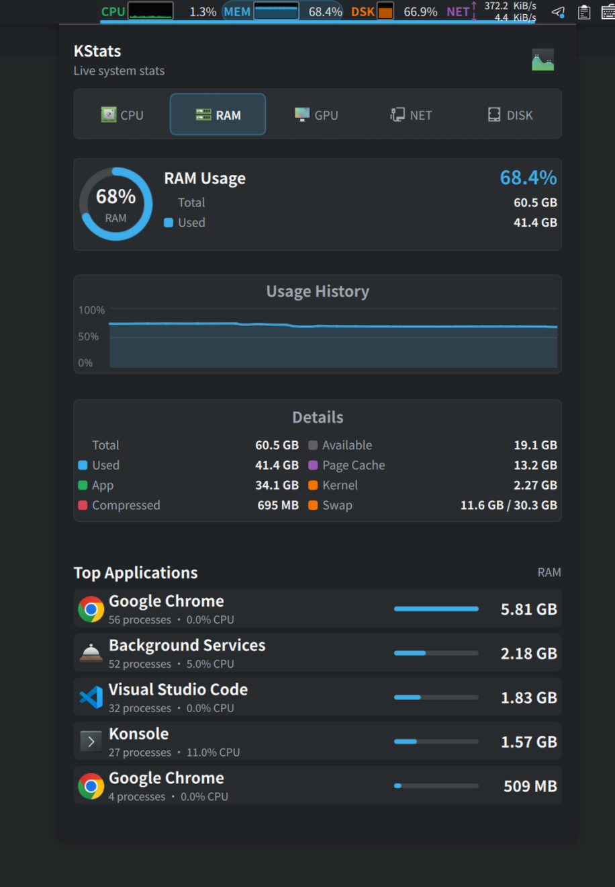
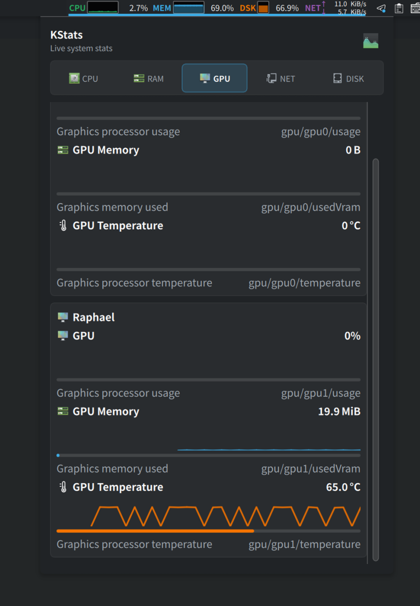

# KStats

KStats is a KDE Plasma 6 panel widget inspired by exelban/stats. The first
version focuses on a menu-bar style status strip with a click-to-open dropdown,
using CPU, memory, disk, and network readings from KDE's KSysGuard sensor API.

## Screenshots

<table>
  <tr>
    <td align="center"><strong>CPU</strong></td>
    <td align="center"><strong>Disk</strong></td>
    <td align="center"><strong>Network</strong></td>
    <td align="center"><strong>Memory</strong></td>
    <td align="center"><strong>GPU</strong></td>
  </tr>
  <tr>
    <td width="20%"></td>
    <td width="20%"></td>
    <td width="20%"></td>
    <td width="20%"></td>
    <td width="20%"></td>
  </tr>
</table>

## Install for the current user

```sh
kpackagetool6 --type Plasma/Applet --install .
```

After installing, add `KStats` from Plasma's widget picker.

For local testing without installing:

```sh
plasmoidviewer --applet .
```

For KDE store:
https://www.opendesktop.org/p/2364289/

## Scope

Implemented:

- compact panel representation
- Stats-like expanded dropdown with CPU, GPU, NET, and DISK tabs
- CPU, memory, disk, network sensors
- CPU model plus auto-discovered CPU temperature and fan sensors
- configurable sensor IDs and update interval
- auto-discovered GPU usage, memory, and temperature sensors

Not implemented yet:

- voltage and power sensors

Those require hardware-specific Linux backends or deeper integration with KDE's
sensor browser and should be added after the basic widget is stable.
